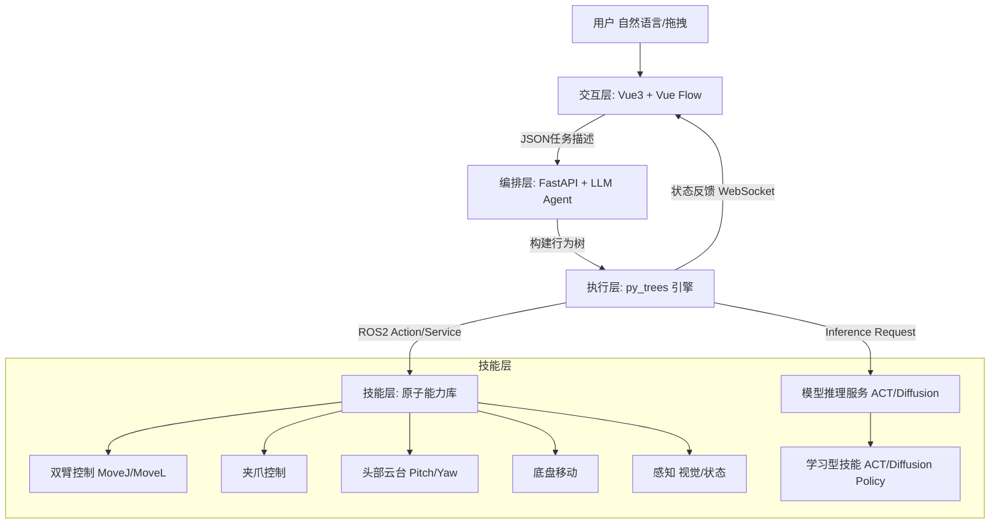

# 具身智能任务编排与执行框架技术路线图

本文档详细阐述了基于 **"大模型（大脑）+ 行为树（小脑）+ 原子技能库（肢体）"** 架构的具身智能任务框架设计。该框架旨在利用现有的底盘、双臂、夹爪及头部控制能力，通过可视化编程和自然语言交互，实现复杂任务的编排与执行。

---

## 1. 总体架构设计

系统自上而下分为四层：**交互层**、**编排层**、**执行层**、**技能层**。



---

## 2. 核心模块详细设计

### 2.1 技能层 (Skill Layer) - 现有硬件能力的封装

这是系统的基石。我们需要将现有的 ROS2 接口封装为标准的**行为树叶子节点 (Leaf Nodes)**。每个节点都必须包含 `Tick` (执行)、`Status` (成功/失败/运行中) 和 `Halt` (中断) 逻辑。

#### A. 机械臂技能 (Arm Skills)
*   **`ArmMoveJ`**: 关节空间运动。
    *   参数: `arm_side` (left/right), `joint_angles` (List[float]), `speed` (float).
    *   逻辑: 调用现有的 `/api/v1/arm/move_j` 或对应的 ROS2 Action。
*   **`ArmMoveL`**: 笛卡尔空间直线运动。
    *   参数: `arm_side`, `pose` (x, y, z, r, p, y), `speed`.
*   **`ArmStop`**: 紧急停止。

#### B. 夹爪技能 (Gripper Skills)
*   **`GripperControl`**: 开合控制。
    *   参数: `arm_side`, `action` (open/close), `force` (optional).
    *   反馈: 需检测夹爪是否到位或夹住物体（通过电流或位置反馈）。

#### C. 头部技能 (Head Skills)
*   **`HeadLookAt`**: 控制头部云台看向特定角度。
    *   参数: `pitch` (上下), `yaw` (左右).
    *   用途: 配合视觉识别，调整视野。
*   **`HeadScan`**: 预定义的扫描动作（如左右摇头寻找物体）。

#### D. 底盘技能 (Chassis Skills)
*   **`BaseMoveTo`**: 移动到指定坐标（导航）。
    *   参数: `x`, `y`, `theta`.
*   **`BaseVelocity`**: 简单的速度控制（前进/后退/旋转）。
    *   参数: `linear_x`, `angular_z`, `duration`.

#### E. 感知与逻辑技能 (Perception & Logic)
*   **`CheckCondition`**: 通用条件检查（如：左臂是否在空闲状态？）。
*   **`Wait`**: 等待指定时间。
*   **`DetectObject`** (未来扩展): 调用视觉模型，返回物体坐标。

#### F. 学习型技能 (Learned Skills - ACT/Diffusion Policy)
针对难以用传统编程描述的复杂灵巧操作（如：叠衣服、穿针引线、非刚体抓取），我们采用模仿学习（Imitation Learning）训练的策略模型。

*   **`ExecuteACTPolicy`**: 执行 ACT (Action Chunking with Transformers) 或 Diffusion Policy 模型。
    *   **参数**: `model_id` (模型名称，如 "fold_tshirt_v1"), `max_steps` (最大执行步数), `stop_condition` (停止条件).
    *   **执行逻辑**:
        1.  **加载模型**: 后端加载指定的 PyTorch/ONNX 模型权重。
        2.  **闭环推理**: 
            *   获取当前观测 (Observation): 头部/手腕相机图像 + 关节状态。
            *   模型推理: 输出未来 N 步的动作序列 (Action Chunk)。
            *   执行动作: 将动作序列下发给机械臂控制器。
            *   循环上述过程，直到完成或超时。
    *   **应用场景**: 具身智能中的"肌肉记忆"部分。

---

### 2.2 交互层 (Interaction Layer) - 可视化编程界面

前端基于 **Vue 3** + **Vue Flow** (或 Rete.js) 构建。

*   **节点面板 (Node Palette)**:
    *   左侧侧边栏列出上述所有原子技能。
    *   分类显示：运动、逻辑（Sequence, Selector, Parallel）、感知。
*   **画布 (Canvas)**:
    *   支持拖拽节点、连线。
    *   **数据流连线**: 例如 `DetectObject` 的输出 `pose` 连接到 `ArmMoveL` 的输入 `target_pose`。
    *   **控制流连线**: 定义执行顺序（通常行为树是从左到右，从上到下，但在可视化中可以用连线表示父子关系）。
*   **属性配置 (Inspector)**:
    *   点击节点，右侧弹出配置面板。
    *   例如点击 `ArmMoveJ` 节点，右侧显示 6 个关节角度的滑块或输入框（可复用现有的 `ArmControlPanel` 组件逻辑）。

### 2.3 编排层 (Orchestration Layer) - 任务描述与 LLM

#### A. 任务描述语言 (Task DSL)
定义一种 JSON 格式来存储编排好的任务。

```json
{
  "task_id": "task_001",
  "name": "双臂协同抓取",
  "root": {
    "id": "node_1",
    "type": "Sequence",
    "children": [
      {
        "id": "node_2",
        "type": "HeadLookAt",
        "params": { "pitch": 0.5, "yaw": 0.0 }
      },
      {
        "id": "node_3",
        "type": "Parallel",
        "children": [
          { "id": "node_4", "type": "ArmMoveJ", "params": { "side": "left", "joints": [...] } },
          { "id": "node_5", "type": "ArmMoveJ", "params": { "side": "right", "joints": [...] } }
        ]
      }
    ]
  }
}
```

#### B. LLM Agent (大模型接入)
*   **Prompt 策略**: 将原子技能库描述为 API 文档提供给 LLM。
*   **输入**: "请把左手抬起来，同时头看向右边，然后底盘向前走 1 米。"
*   **输出**: 生成上述 JSON 结构。
*   **修正**: 生成的 JSON 自动渲染在前端画布上，用户可以手动微调参数。

### 2.4 执行层 (Execution Layer) - 行为树引擎

后端使用 Python 的 `py_trees` 库。

*   **解析器**: 将前端传来的 JSON 递归解析为 `py_trees` 的对象树。
*   **Tick 循环**: 以固定频率（如 10Hz）运行 `tree.tick()`。
*   **状态同步**:
    *   每次 Tick 后，遍历树的状态。
    *   通过 WebSocket 将 `active_node_id` 和 `status` (RUNNING/SUCCESS/FAILURE) 推送给前端。
    *   前端根据 ID 高亮正在执行的节点。

### 2.5 数据与状态流设计 (Blackboard & Telemetry)

为了让复杂任务在多传感器、多控制器之间稳健运行，需要统一的数据与状态流：

*   **黑板 (Blackboard)**: 行为树运行时的共享内存，采用键值/命名空间结构。感知节点写入 `objects.cup.pose`、`env.table.height` 等变量，动作节点只读取自己的依赖字段，避免直接耦合。
*   **参数绑定与类型校验**: 每个节点在 DSL 中声明输入/输出 schema（JSON Schema 或 Pydantic），解析器在执行前完成静态检查，运行中自动做单位转换与边界裁剪。
*   **事件与告警总线**: 底层驱动的异常（超力矩、碰撞、通信丢失）统一发布到 `system.events`，Guard/Decorator 节点订阅该通道实现快速熔断。
*   **遥测与回放**: 所有黑板变量与节点状态写入时序数据库（如 InfluxDB），用于任务回放、调参、模型训练数据的再利用。

---

## 3. 开发实施路线图 (Roadmap)

### 第一阶段：基础框架与原子技能封装 (MVP)
**目标**: 手动拖拽节点，机器人能按顺序执行简单的动作序列。

1.  **后端**:
    *   引入 `py_trees`。
    *   实现 `SkillNode` 基类。
    *   封装 `ArmMoveJ`, `GripperControl`, `HeadLookAt` 为行为树节点。
    *   实现 `/api/task/execute` 接口，接收 JSON 并执行。
2.  **前端**:
    *   集成 `Vue Flow`。
    *   实现基础节点组件（Sequence, Action）。
    *   实现 JSON 导出与发送功能。

### 第二阶段：复杂逻辑与状态反馈
**目标**: 支持并行执行（双臂同时动）、条件判断，并实时看到执行进度。

1.  **后端**:
    *   引入 `Parallel` (并行) 和 `Selector` (选择/回退) 节点。
    *   建立 WebSocket 服务，实时推送执行状态。
    *   实现任务的 `Pause` (暂停) 和 `Cancel` (取消)。
2.  **前端**:
    *   实现运行时高亮效果。
    *   增加“调试模式”，允许单步执行。

### 第三阶段：大模型接入与感知闭环
**目标**: 说一句话生成任务，且任务中包含感知反馈（如“看到物体再抓”）。

1.  **AI**:
    *   接入 OpenAI/Claude/DeepSeek API。
    *   编写 Prompt Template，实现 Text-to-JSON。
2.  **感知**:
    *   封装视觉识别节点。
    *   实现节点间的数据黑板 (Blackboard) 机制，让识别结果能传递给抓取节点。

---

## 4. 针对现有硬件的特殊考虑

1.  **双臂协同**:
    *   在行为树中，使用 `Parallel` 节点来同时控制左臂和右臂。
    *   **注意**: 需要在底层确保护涉检测（Collision Avoidance），防止双臂打架。MoveIt 已经提供了一部分支持，但在任务编排层最好加上互斥锁或预设的安全点。

2.  **头部与手眼配合**:
    *   头部控制通常是为了辅助视觉。建议设计一种复合节点 `LookAndDetect`，先转动头部，稳定后再触发识别。

3.  **底盘移动**:
    *   底盘移动通常耗时较长。在行为树中，底盘移动节点在未到达目标前应返回 `RUNNING` 状态，且支持被高优先级的事件（如急停）打断。

4.  **安全性**:
    *   必须有一个全局的 `Guard` 节点（装饰器节点），实时监控急停按钮或底层错误状态，一旦触发立即中断整棵树的执行。

5.  **混合控制策略 (Hybrid Control)**:
    *   框架支持**确定性控制**与**学习型控制**的无缝切换。
    *   例如：使用确定性的 `BaseMoveTo` 导航到桌子前（可靠、可预测），然后切换到 `ExecuteACTPolicy` 执行灵巧抓取（泛化能力强），抓取完成后再切回确定性控制进行复位。
    *   **数据采集模式**: 框架应包含一个"示教模式"，允许通过 VR 遥操作采集数据，用于训练新的 ACT 技能，训练完成后自动注册为新的行为树节点。

---

## 5. 数据与协作治理 (Data & Collaboration Governance)

1.  **任务版本管理**: 所有任务 DSL 以 Git-LFS 或数据库版本号管理，编辑器在保存时生成变更集，支持 Diff/审查/回滚，避免多人误改造成的执行不一致。
2.  **模板与资产库**: 常用任务（抓杯、递物、巡检）沉淀为模板，参数化后直接复用；资产引用（模型 ID、点位、速度曲线）统一从配置中心读取，防止硬编码。
3.  **审批与发布流程**: 重要任务必须经过“编辑 -> 仿真验证 -> 线下回放 -> 上线审批”四个 Gate，只有通过审批的版本才能推送到运行集群。
4.  **数据闭环**: 示教数据、运行日志、故障信息统一入库，训练管线从该数据湖中抽取样本，形成“运行 -> 数据 -> 训练 -> 上线”的可追溯闭环。
5.  **权限与审计**: 细粒度角色划分（操作员/开发者/审核者），所有执行、暂停、取消操作写入审计日志，满足安全和责任追踪需求。

### 5.1 预设资产管理 (Preset Assets)

为了让确定性任务更易于编排和复用，框架内置**资产库**管理以下内容：

| 资产类型 | 说明 | 示例 |
|---------|------|------|
| **命名点位 (Named Locations)** | 底盘导航目标点，包含 (x, y, theta) | `charging_station`, `point_A`, `kitchen_door` |
| **命名姿态 (Named Poses)** | 预设的关节角度组合 | `home_pose`, `observe_pose`, `handover_pose` |
| **速度曲线 (Speed Profiles)** | 不同场景下的速度配置 | `slow_careful`, `normal`, `fast_transit` |
| **头部预设 (Head Presets)** | 常用的 pitch/yaw 组合 | `look_forward`, `look_down_table`, `look_left_45` |

**使用方式**:
*   在节点参数中通过 `location: "point_A"` 或 `pose_name: "home_pose"` 引用。
*   资产库存储在 `config/assets.yaml`，支持在前端可视化编辑。
*   运行时解析器自动将名称解析为实际数值。

---

## 6. 典型场景案例分析 (Case Study)

### 6.1 场景一：纯确定性巡检任务 (Deterministic Patrol)
**任务描述**: 机器人依次移动到 A、B、C 三个预设点位，在每个点位执行预设的观察姿态，完成后返回充电桩。

#### 任务特点
*   **无需模型**: 所有动作都是预先定义好的，不涉及视觉识别或学习型策略。
*   **可复用**: 通过参数化（点位列表、姿态名称），同一模板可用于不同场景。

#### 行为树结构
```json
{
  "name": "Daily Patrol",
  "root": {
    "type": "Sequence",
    "children": [
      { "type": "BaseMoveTo", "params": { "location": "point_A" } },
      { "type": "HeadLookAt", "params": { "pitch": 0.3, "yaw": -0.5 } },
      { "type": "Wait", "params": { "duration": 2.0 } },
      { "type": "BaseMoveTo", "params": { "location": "point_B" } },
      { "type": "ArmMoveJ", "params": { "side": "both", "pose_name": "observe_pose" } },
      { "type": "Wait", "params": { "duration": 2.0 } },
      { "type": "ArmMoveJ", "params": { "side": "both", "pose_name": "home_pose" } },
      { "type": "BaseMoveTo", "params": { "location": "point_C" } },
      { "type": "HeadScan", "params": { "pattern": "left_right" } },
      { "type": "BaseMoveTo", "params": { "location": "charging_station" } }
    ]
  }
}
```

#### 关键设计说明
*   `pose_name` 和 `location` 引用的是**预设资产库**中的命名点位/姿态，而非硬编码数值。
*   `side: "both"` 表示双臂同步执行同一姿态（内部自动拆分为 Parallel 执行左右臂）。

---

### 6.2 场景二：端水杯任务 (Fetch Water Cup - 混合控制)
**任务描述**: 机器人移动到桌子旁，端起装满水的杯子，然后送到用户面前。

#### 任务拆解 (Task Decomposition)
这个任务完美展示了**确定性控制**与**学习型策略**的混合编排：

1.  **阶段一：接近目标 (Deterministic)**
    *   使用传统导航算法，快速且准确地移动到桌子前的预设点位。
    *   **节点**: `BaseMoveTo(x=2.5, y=1.0, theta=90)`
2.  **阶段二：灵巧操作 (Learned Policy - ACT)**
    *   切换到神经网络控制。模型接管头部相机和双臂，执行“寻找杯子 -> 调整姿态 -> 柔顺抓取 -> 平稳端起”的一系列复杂动作。
    *   **节点**: `ExecuteACTPolicy(model="pick_cup_v2", max_steps=500)`
    *   *注：此模型是通过 VR 遥操作示教训练出来的，它内部自动处理了手眼协调和双臂配合。*
3.  **阶段三：运送 (Deterministic)**
    *   抓取成功后，切换回导航模式，移动到用户所在位置。
    *   **节点**: `BaseMoveTo(x=0.0, y=0.0, theta=0)`

#### 对应的行为树结构 (JSON Representation)
```json
{
  "name": "Fetch Water Cup",
  "root": {
    "type": "Sequence",
    "children": [
      {
        "type": "BaseMoveTo",
        "name": "移动到餐桌",
        "params": { "location": "table_point_A" }
      },
      {
        "type": "ExecuteACTPolicy",
        "name": "端起水杯模型",
        "params": { 
          "model_id": "act_pick_cup_v1",
          "stop_condition": "lift_success" 
        }
      },
      {
        "type": "BaseMoveTo",
        "name": "移动到用户位置",
        "params": { "location": "user_point_B" }
      }
    ]
  }
}
```

---

## 7. 技术难点与风险评估 (Technical Challenges & Risks)

### 7.1 技术难点
1.  **双臂协同避障**: 
    *   **问题**: 在 `Parallel` 节点执行时，若指令未经过统一规划，双臂可能发生碰撞。
    *   **对策**: 集成 MoveIt 的实时碰撞检测；在行为树层面增加互斥锁（Mutex）；预设安全工作区域。
2.  **行为树状态实时同步**: 
    *   **问题**: 高频 Tick (10-20Hz) 下，通过 WebSocket 传输整棵树的状态可能导致前端渲染卡顿或延迟。
    *   **对策**: 采用增量更新机制（只推送状态变化的节点）；前端使用 requestAnimationFrame 优化渲染。
3.  **ACT 模型推理实时性**: 
    *   **问题**: 大模型（如 Diffusion Policy）推理计算量大，可能无法满足 10Hz-50Hz 的控制闭环要求。
    *   **对策**: 使用 TensorRT 加速推理；部署独立的推理服务器（GPU）；采用异步推理策略。
4.  **LLM 生成的可靠性**: 
    *   **问题**: LLM 可能生成逻辑错误的任务图（如死循环、缺少前置条件、参数幻觉）。
    *   **对策**: 设计严格的 DSL 校验器 (Validator)；引入 RAG (检索增强生成) 绑定正确的 API 文档；强制的人机确认环节 (Human-in-the-loop)。
5.  **推理基础设施规划**:
    *   **问题**: 模型推理与传统控制抢占同一算力会导致抖动。
    *   **对策**: 规划独立的 GPU/Edge AI 服务器，采用 gRPC/ROS2 action 远程调用，并通过 QoS 限制带宽和延迟。

### 7.2 风险点
1.  **硬件安全风险**: 
    *   自动生成的任务可能包含超出机械臂工作空间或速度限制的指令。
    *   **缓解**: 必须实施多层安全策略（底层驱动限位、运动学逆解校验、急停按钮硬件中断）。
2.  **网络通信风险**: 
    *   视觉数据传输（摄像头 -> 后端）和控制指令下发对网络延迟敏感。WiFi 环境下可能出现丢包导致动作卡顿或失控。
    *   **缓解**: 关键控制链路使用有线连接；设置心跳检测，超时自动急停。
3.  **数据一致性**: 
    *   前端编辑器、后端数据库、运行时引擎三者之间的任务版本管理容易出错。
    *   **缓解**: 统一使用 JSON 配置文件作为唯一真理来源 (Single Source of Truth)。

### 7.3 安全与故障恢复策略
1.  **守护节点 (Guardian Decorator)**: 包装所有高风险子树，实时检测力/扭矩/视觉异常，触发后立即执行 `ArmStop`、`BaseStop`、`GripperRelease`。
2.  **Fail-Safe 级联**: 行为树失败 -> 触发恢复子树（退回安全姿态）-> 若失败继续升级到系统级急停。确保学习型节点不可直连硬件，必须经过安全 Wrapper。
3.  **远程接管 (Remote Takeover)**: 当任务陷入死锁或多次重试失败时，系统应主动挂起并通知操作员。操作员可通过 VR 遥操作接口（参考 `VR_TELEOPERATION_ARCHITECTURE.md`）介入，手动完成当前步骤，然后将控制权交还给行为树。
4.  **仿真优先**: 新任务和新模型必须先在 Gazebo/Isaac Sim 中通过回放测试，只有达到成功率与安全指标才允许上真人/真机。

---

## 8. 详细实施计划 (Detailed Implementation Plan)

### 阶段一：核心链路打通 (MVP) - 预计周期：3周
**目标**: 完成编辑器基础功能，跑通 "移动 -> 夹取" 的固定序列。

*   **Week 1: 后端基础架构**
    *   [ ] 搭建 `py_trees` 运行环境与 ROS2 节点的集成。
    *   [ ] 封装基础原子技能: `ArmMoveJ`, `GripperControl` 为行为树节点。
    *   [ ] 实现 JSON -> BehaviorTree 的解析器 (Parser)。
    *   [ ] 定义任务文件存储格式。
*   **Week 2: 前端可视化编辑器**
    *   [ ] 集成 Vue Flow 库。
    *   [ ] 开发自定义节点组件 (Node Components): 动作节点、参数配置面板。
    *   [ ] 实现画布数据的序列化 (Export JSON) 与反序列化 (Import JSON)。
*   **Week 3: 联调与闭环测试**
    *   [ ] 实现 `/api/task/execute` 接口。
    *   [ ] 联调前后端：前端点击运行 -> 后端解析执行 -> 机器人动作。
    *   [ ] 编写 MVP 阶段测试报告。

### 阶段二：高级特性与状态反馈 - 预计周期：4周
**目标**: 支持并行/逻辑控制，实现实时状态监控。

*   **Week 4: 状态同步系统**
    *   [ ] 搭建 WebSocket 服务。
    *   [ ] 实现后端 Tick 循环中的状态广播 (Broadcaster)。
    *   [ ] 前端实现节点运行时高亮、进度条显示。
*   **Week 5: 逻辑控制节点**
    *   [ ] 实现 `Parallel` (并行), `Selector` (选择/回退), `Decorator` (循环/超时) 节点。
    *   [ ] 添加任务控制接口: `Pause` (暂停), `Resume` (恢复), `Cancel` (取消)。
*   **Week 6: 头部与底盘集成**
    *   [ ] 封装 `HeadLookAt`, `BaseMoveTo` 节点。
    *   [ ] 解决底盘长时任务的异步状态管理问题 (Action Client 封装)。
*   **Week 7: 综合场景测试**
    *   [ ] 测试双臂同时运动的场景（验证无碰撞）。
    *   [ ] 压力测试：长时间运行循环任务，检测内存泄漏。

### 阶段三：AI 赋能与闭环 - 预计周期：5周
**目标**: 接入视觉感知、ACT 模型与 LLM 生成。

*   **Week 8: 视觉感知接入**
    *   [ ] 封装 `DetectObject` 节点 (调用 YOLO/SAM)。
    *   [ ] 实现 Blackboard 数据共享机制（感知结果 -> 动作输入）。
*   **Week 9: ACT/Diffusion 模型集成**
    *   [ ] 搭建 PyTorch 推理服务接口。
    *   [ ] 实现 `ExecuteACTPolicy` 节点。
    *   [ ] 验证 "VR示教 -> 数据处理 -> 模型训练 -> 节点调用" 的全流程。
*   **Week 10: LLM Agent 开发**
    *   [ ] 设计 Prompt Template 与 Function Calling 定义。
    *   [ ] 接入 OpenAI/Claude/DeepSeek API。
    *   [ ] 实现自然语言转 JSON 的生成与校验逻辑。
*   **Week 11-12: 系统优化与交付**
    *   [ ] 优化 UI 交互体验 (快捷键、撤销重做)。
    *   [ ] 编写用户手册、API 文档与开发者指南。
    *   [ ] 项目验收与演示。
