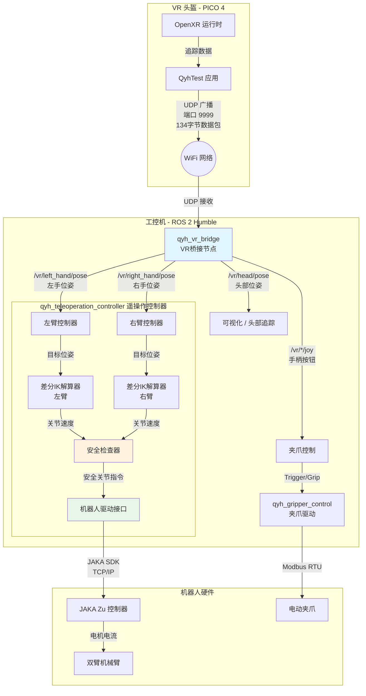

# VR 遥操作数据流

本文档描述了基于 VR 的机器人遥操作系统的数据流，从 PICO 4 头盔到物理机械臂的完整链路。

## 系统架构图



## 详细数据流说明

### 第一层：VR 数据采集与发送

```
┌─────────────────────────────────────────────────────────────────┐
│                     PICO 4 VR 头盔                              │
├─────────────────────────────────────────────────────────────────┤
│  OpenXR Runtime                                                 │
│       │                                                         │
│       ▼ XrFrameIn 结构体                                        │
│  ┌─────────────────────────────────────────────────────────┐   │
│  │  • head_pose: 头部位姿 (位置 + 四元数)                    │   │
│  │  • controller_poses[2]: 左右手柄位姿                      │   │
│  │  • controller_trigger_value[2]: 扳机值 (0.0~1.0)         │   │
│  │  • controller_grip_value[2]: 侧键值 (0.0~1.0)            │   │
│  │  • joystick_position[2]: 摇杆位置 (x, y)                 │   │
│  │  • buttons_bitmask: 按钮位掩码                            │   │
│  └─────────────────────────────────────────────────────────┘   │
│       │                                                         │
│       ▼ QyhTest 应用 (Native C++ OpenXR)                       │
│       │                                                         │
│       ▼ UDP 广播 255.255.255.255:9999                          │
│  ┌─────────────────────────────────────────────────────────┐   │
│  │  134 字节紧凑数据包 (#pragma pack(1))                     │   │
│  │  • timestamp: int64 (8B)                                 │   │
│  │  • head_position[3]: float (12B)                         │   │
│  │  • head_orientation[4]: float (16B)                      │   │
│  │  • left_active: uint8 (1B)                               │   │
│  │  • left_position[3], left_orientation[4]: (28B)          │   │
│  │  • left_joystick[2], trigger, grip: (16B)                │   │
│  │  • right_*: 同上 (45B)                                   │   │
│  │  • buttons_bitmask, touches_bitmask: uint32 (8B)         │   │
│  └─────────────────────────────────────────────────────────┘   │
└─────────────────────────────────────────────────────────────────┘
```

### 第二层：ROS 2 桥接与转换

```
┌─────────────────────────────────────────────────────────────────┐
│                    qyh_vr_bridge 节点                           │
├─────────────────────────────────────────────────────────────────┤
│  UDP Socket (端口 9999)                                         │
│       │                                                         │
│       ▼ 解析 ControllerDataPacket                               │
│       │                                                         │
│       ├──▶ /vr/head/pose         (geometry_msgs/PoseStamped)   │
│       ├──▶ /vr/left_hand/pose    (geometry_msgs/PoseStamped)   │
│       ├──▶ /vr/right_hand/pose   (geometry_msgs/PoseStamped)   │
│       ├──▶ /vr/left_hand/joy     (sensor_msgs/Joy)             │
│       │       axes[0]: 摇杆X, axes[1]: 摇杆Y                    │
│       │       axes[2]: Trigger, axes[3]: Grip                   │
│       │       buttons[0]: X, buttons[1]: Y, buttons[2]: Menu   │
│       ├──▶ /vr/right_hand/joy    (sensor_msgs/Joy)             │
│       │       buttons[0]: A, buttons[1]: B, buttons[2]: Home   │
│       ├──▶ /vr/left_hand/active  (std_msgs/Bool)               │
│       ├──▶ /vr/right_hand/active (std_msgs/Bool)               │
│       │                                                         │
│       └──▶ TF 广播                                              │
│            • vr_origin -> vr_head                               │
│            • vr_origin -> vr_left_hand                          │
│            • vr_origin -> vr_right_hand                         │
└─────────────────────────────────────────────────────────────────┘
```

### 第三层：遥操作控制算法

```
┌─────────────────────────────────────────────────────────────────┐
│              qyh_teleoperation_controller 节点                  │
├─────────────────────────────────────────────────────────────────┤
│                                                                 │
│  订阅: /vr/left_hand/pose, /vr/right_hand/pose                 │
│       │                                                         │
│       ▼ 坐标变换 (VR坐标系 -> 机器人基坐标系)                    │
│       │                                                         │
│       ▼ 差分逆运动学 (Differential IK)                          │
│  ┌─────────────────────────────────────────────────────────┐   │
│  │  目标: 计算使末端执行器跟随VR手柄的关节速度               │   │
│  │                                                          │   │
│  │  1. 计算位姿误差 Δx = x_target - x_current               │   │
│  │  2. 获取雅可比矩阵 J(q)                                   │   │
│  │  3. 阻尼最小二乘: q̇ = J^T(JJ^T + λI)^{-1} Δx            │   │
│  │  4. 积分得到目标关节位置: q_new = q + q̇ * dt            │   │
│  └─────────────────────────────────────────────────────────┘   │
│       │                                                         │
│       ▼ 轨迹平滑器 (TrajectorySmoother)                         │
│       │  • 限制关节速度、加速度、加加速度                        │
│       │  • 平滑突变，避免机械冲击                                │
│       │                                                         │
│       ▼ 安全检查器 (SafetyChecker)                              │
│       │  • 关节限位检查                                          │
│       │  • 速度限制检查                                          │
│       │  • 自碰撞检测 (可选)                                     │
│       │                                                         │
│       ▼ 发布关节指令                                            │
│          /left_arm/joint_command, /right_arm/joint_command     │
└─────────────────────────────────────────────────────────────────┘
```

### 第四层：机器人驱动执行

```
┌─────────────────────────────────────────────────────────────────┐
│                    qyh_jaka_control 节点                        │
├─────────────────────────────────────────────────────────────────┤
│                                                                 │
│  订阅: /left_arm/joint_command, /right_arm/joint_command       │
│       │                                                         │
│       ▼ JAKA SDK 接口                                           │
│  ┌─────────────────────────────────────────────────────────┐   │
│  │  • servo_j(): 关节伺服模式 (8ms周期)                      │   │
│  │  • servo_p(): 笛卡尔伺服模式                              │   │
│  │  • moveJ/moveL: 点位运动                                  │   │
│  └─────────────────────────────────────────────────────────┘   │
│       │                                                         │
│       ▼ TCP/IP 通信 (端口 10001/10002)                          │
│       │                                                         │
│       ▼ JAKA Zu 控制器                                          │
│       │                                                         │
│       ▼ 物理机械臂执行                                          │
└─────────────────────────────────────────────────────────────────┘
```

### 夹爪控制支路

```
┌─────────────────────────────────────────────────────────────────┐
│                      夹爪控制流程                               │
├─────────────────────────────────────────────────────────────────┤
│                                                                 │
│  /vr/left_hand/joy, /vr/right_hand/joy                         │
│       │                                                         │
│       ▼ 映射规则                                                │
│  ┌─────────────────────────────────────────────────────────┐   │
│  │  • Trigger (axes[2]) > 0.8  →  夹爪闭合                   │   │
│  │  • Grip (axes[3]) > 0.8     →  夹爪张开                   │   │
│  │  • 或: Trigger 连续值映射到夹爪开度                       │   │
│  └─────────────────────────────────────────────────────────┘   │
│       │                                                         │
│       ▼ qyh_gripper_control                                    │
│       │                                                         │
│       ▼ Modbus RTU 通信 → 电动夹爪                              │
└─────────────────────────────────────────────────────────────────┘
```

## 关键参数配置

| 参数 | 值 | 说明 |
|------|-----|------|
| UDP 端口 | 9999 | VR 数据广播端口 |
| 数据包大小 | 134 bytes | 紧凑结构体 |
| 控制频率 | 125 Hz | 8ms 周期 |
| IK 阻尼系数 | 0.01 | 避免奇异点 |
| 最大关节速度 | 1.0 rad/s | 安全限制 |

## 启动顺序

1. **启动 ROS 2 节点**
   ```bash
   # 终端 1: VR 桥接
   ros2 run qyh_vr_bridge vr_bridge_node
   
   # 终端 2: 机械臂驱动
   ros2 launch qyh_jaka_control dual_arm.launch.py
   
   # 终端 3: 遥操作控制器
   ros2 launch qyh_teleoperation_controller teleoperation_controller.launch.py
   ```

2. **在 PICO 4 上启动 QyhTest 应用**
   - 确保 PICO 4 和工控机在同一局域网
   - 启动 QyhTest 应用，自动开始 UDP 广播

3. **验证数据流**
   ```bash
   # 查看 VR 话题
   ros2 topic echo /vr/left_hand/pose
   ros2 topic echo /vr/right_hand/joy
   ```
