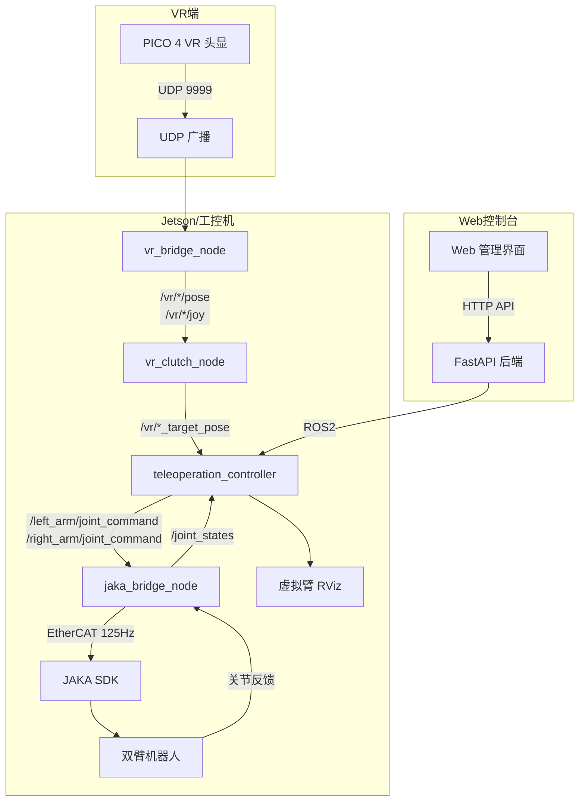

# VR 遥操作真机控制指南

## 目标

用 PICO 4 VR 手柄控制真实 JAKA ZU7 双臂机器人，实现低延迟、高精度的遥操作控制。

**控制方式**: Clutch 离合器模式
- **按住 Grip 键**: 机械臂跟随 VR 手柄移动
- **松开 Grip 键**: 机械臂保持当前位置

## ⚠️ 安全警告

> **真机操作前请务必确认：**
> 1. 机械臂工作空间内无人员和障碍物
> 2. 急停按钮在手边，随时可触发
> 3. 首次测试使用低速模式
> 4. 熟悉机械臂工作范围

---

## 系统架构



---

## 数据流详解

```
┌─────────────────────────────────────────────────────────────────────────────────┐
│                           真机 VR 遥操作数据流                                    │
├─────────────────────────────────────────────────────────────────────────────────┤
│                                                                                 │
│   PICO VR (90Hz)                                                                │
│        │ UDP 9999                                                               │
│        ▼                                                                        │
│   ┌─────────────────────┐                                                       │
│   │   vr_bridge_node    │  坐标变换: VR→ROS, 握持补偿                           │
│   └─────────────────────┘                                                       │
│        │ /vr/left_hand/pose, /vr/left_hand/joy                                 │
│        │ /vr/right_hand/pose, /vr/right_hand/joy                               │
│        ▼                                                                        │
│   ┌─────────────────────┐                                                       │
│   │   vr_clutch_node    │  simulation_mode=false                               │
│   │   Clutch 离合器控制  │  grip>0.8: 接合, grip<0.2: 释放                      │
│   └─────────────────────┘                                                       │
│        │ /vr/left_target_pose, /vr/right_target_pose                           │
│        │ /vr/left_clutch_engaged, /vr/right_clutch_engaged                     │
│        ▼                                                                        │
│   ┌─────────────────────────────────────────┐                                   │
│   │   qyh_teleoperation_controller          │                                   │
│   │   ├─ 差分IK (Damped Least Squares)      │                                   │
│   │   ├─ 轨迹平滑 (速度/加速度/jerk限幅)     │                                   │
│   │   └─ 安全检查 (关节限位/碰撞/奇异点)     │                                   │
│   └─────────────────────────────────────────┘                                   │
│        │ /left_arm/joint_command (JointState, 125Hz)                           │
│        │ /right_arm/joint_command (JointState, 125Hz)                          │
│        ▼                                                                        │
│   ┌─────────────────────┐                                                       │
│   │  jaka_bridge_node   │  轨迹缓冲 + 线性插值                                  │
│   │  (125Hz EtherCAT)   │                                                       │
│   └─────────────────────┘                                                       │
│        │ edgServoJ (8ms 周期)                                                   │
│        ▼                                                                        │
│   ┌─────────────────────┐                                                       │
│   │    JAKA SDK         │                                                       │
│   └─────────────────────┘                                                       │
│        │                                                                        │
│        ▼                                                                        │
│   ┌─────────────────────┐                                                       │
│   │  双臂机器人          │  JAKA ZU7 × 2                                        │
│   │  (192.168.2.200)    │                                                       │
│   └─────────────────────┘                                                       │
│                                                                                 │
└─────────────────────────────────────────────────────────────────────────────────┘
```

---

## 第一步：硬件检查

### 1.1 设备连接确认

| 设备 | 连接方式 | IP 地址 | 检查方法 |
|------|----------|---------|----------|
| JAKA 双臂 | EtherCAT | 192.168.2.200 | `ping 192.168.2.200` |
| Jetson | 有线网络 | 192.168.2.x | - |
| PICO VR | WiFi (同一局域网) | DHCP | VR 应用内显示 |

### 1.2 网络连通性测试

```bash
# 在 Jetson 上测试
ping 192.168.2.200  # JAKA 机器人

# 检查 UDP 端口是否被占用
sudo lsof -i :9999
```

---

## 第二步：Web 控制台操作 (推荐)

### 2.1 启动 Web 服务

```bash
# 终端 1: 启动后端
cd ~/qyh_jushen_ws/qyh_jushen_web/backend
source venv/bin/activate
uvicorn app.main:app --host 0.0.0.0 --port 8000

# 终端 2: 启动前端
cd ~/qyh_jushen_ws/qyh_jushen_web/frontend
npm run dev -- --host
```

### 2.2 访问 Web 界面

浏览器打开: `http://<Jetson_IP>:3000`

- 用户名: `admin`
- 密码: `admin123`

### 2.3 机械臂上电与使能 (Web 界面操作)

> **重要**: 必须按顺序执行！

```
┌─────────────────────────────────────────────────────────────────┐
│                    机械臂控制面板                                │
├─────────────────────────────────────────────────────────────────┤
│                                                                 │
│  1️⃣ 电源控制                                                    │
│     ┌──────────┐    ┌──────────┐                               │
│     │  上 电   │ ←  │  下 电   │                               │
│     └──────────┘    └──────────┘                               │
│     (点击"上电"按钮，等待机械臂电源灯亮)                          │
│                                                                 │
│  2️⃣ 使能控制                                                    │
│     ┌──────────┐    ┌──────────┐                               │
│     │  使 能   │ ←  │ 去使能   │                               │
│     └──────────┘    └──────────┘                               │
│     (点击"使能"按钮，机械臂可以运动)                              │
│                                                                 │
│  3️⃣ 伺服模式                                                    │
│     ┌──────────┐    ┌──────────┐                               │
│     │启动伺服  │ ←  │停止伺服  │                               │
│     └──────────┘    └──────────┘                               │
│     (启动伺服后，可以接收 VR 遥操作命令)                          │
│                                                                 │
└─────────────────────────────────────────────────────────────────┘
```

**操作步骤**:

1. **上电**: 点击"上电"按钮
   - 等待状态变为"已上电" (绿色指示灯)
   - 约需 3-5 秒

2. **使能**: 点击"使能"按钮
   - 等待状态变为"已使能"
   - 机械臂会有轻微震动，表示关节已锁定

3. **启动伺服**: 点击"启动伺服"按钮
   - 状态显示"运行中"
   - 显示伺服频率 (约 125 Hz)

### 2.4 VR 遥操作面板

切换到 "VR 遥操作" 标签页：

```
┌─────────────────────────────────────────────────────────────────┐
│                    VR 遥操作面板                                 │
├─────────────────────────────────────────────────────────────────┤
│                                                                 │
│  VR 状态: ● 已连接                                              │
│                                                                 │
│  ┌────────────────────┐    ┌────────────────────┐              │
│  │      左 手         │    │      右 手         │              │
│  │                    │    │                    │              │
│  │   🔓 CLUTCH OFF    │    │   🔒 CLUTCH ON     │              │
│  │                    │    │                    │              │
│  │   Grip: ████░░ 60% │    │   Grip: ██████ 95% │              │
│  └────────────────────┘    └────────────────────┘              │
│                                                                 │
│  操作指南:                                                      │
│  • 按住 Grip 键 (>80%) 接合 Clutch                              │
│  • 松开 Grip 键 (<20%) 释放 Clutch                              │
│  • Clutch 接合时机械臂跟随 VR 手柄移动                           │
│                                                                 │
└─────────────────────────────────────────────────────────────────┘
```

---

## 第三步：ROS2 节点启动

### 3.1 一键启动脚本

```bash
cd ~/qyh_jushen_ws/qyh_jushen_ws
./src/start_vr_real_robot.sh
```

### 3.2 手动分步启动

如果需要调试，可以分步启动：

#### 终端 1: MoveIt (用于 IK 计算和可视化)

```bash
cd ~/qyh_jushen_ws/qyh_jushen_ws
source /opt/ros/humble/setup.bash
source install/setup.bash
ros2 launch qyh_dual_arms_moveit_config move_group.launch.py
```

#### 终端 2: VR Bridge (接收 VR 数据)

```bash
cd ~/qyh_jushen_ws/qyh_jushen_ws
source /opt/ros/humble/setup.bash
source install/setup.bash
ros2 run qyh_vr_bridge vr_bridge_node --ros-args -p grip_offset_deg:=35.0
```

#### 终端 3: VR Clutch (离合器控制, 真机模式)

```bash
cd ~/qyh_jushen_ws/qyh_jushen_ws
source /opt/ros/humble/setup.bash
source install/setup.bash
ros2 launch qyh_vr_calibration vr_clutch.launch.py simulation_mode:=false
```

#### 终端 4: Teleoperation Controller (差分 IK + 平滑)

```bash
cd ~/qyh_jushen_ws/qyh_jushen_ws
source /opt/ros/humble/setup.bash
source install/setup.bash
ros2 launch qyh_teleoperation_controller teleoperation_controller.launch.py
```

#### 终端 5: JAKA Bridge (125Hz 伺服)

```bash
cd ~/qyh_jushen_ws/qyh_jushen_ws
source /opt/ros/humble/setup.bash
source install/setup.bash
ros2 launch qyh_jaka_control jaka_bridge.launch.py robot_ip:=192.168.2.200
```

---

## 第四步：开始遥操作

### 4.1 启动 VR 应用

1. 戴上 PICO 4 头显
2. 启动 VR 遥操作应用
3. 确认 Web 界面显示 "VR 已连接"

### 4.2 操作流程

```
┌─────────────────────────────────────────────────────────────────┐
│                    VR 遥操作流程                                 │
├─────────────────────────────────────────────────────────────────┤
│                                                                 │
│  1. 确认机械臂已使能、伺服已启动                                  │
│                                                                 │
│  2. 将 VR 手柄移动到舒适位置                                     │
│                                                                 │
│  3. 按住 Grip 键 (侧面握键)                                     │
│     └─→ Web 界面显示 "CLUTCH ON"                                │
│     └─→ 机械臂开始跟随 VR 手柄                                   │
│                                                                 │
│  4. 移动手柄控制机械臂                                           │
│     • 位置: 手柄位移 × 缩放比例 = 末端位移                        │
│     • 姿态: 手柄旋转 = 末端旋转                                  │
│                                                                 │
│  5. 松开 Grip 键                                                │
│     └─→ Web 界面显示 "CLUTCH OFF"                               │
│     └─→ 机械臂保持当前位置                                       │
│                                                                 │
│  6. 重新按住 Grip → 从当前位置继续跟随                           │
│                                                                 │
└─────────────────────────────────────────────────────────────────┘
```

---

## 参数配置

### Clutch 参数

文件: `qyh_vr_calibration/config/vr_clutch_params.yaml`

```yaml
vr_clutch_node:
  ros__parameters:
    simulation_mode: false    # 真机模式
    clutch:
      engage_threshold: 0.8   # grip > 0.8 接合
      release_threshold: 0.2  # grip < 0.2 释放
      position_scale: 1.5     # 位置缩放 (机械臂/人臂 约1.5倍)
      rotation_scale: 1.0     # 旋转缩放
      max_position_delta: 0.02  # 单帧最大位移 (m)
      max_rotation_delta: 0.05  # 单帧最大旋转 (rad)
```

### Teleoperation Controller 参数

文件: `qyh_teleoperation_controller/config/teleoperation_params.yaml`

```yaml
teleoperation_node:
  ros__parameters:
    control_frequency: 125.0   # 控制频率 (Hz)
    
    differential_ik:
      position_tolerance: 0.001   # 位置容差 (m)
      orientation_tolerance: 0.01 # 姿态容差 (rad)
      damping_factor: 0.01        # 阻尼系数
      
    trajectory_smoothing:
      max_velocity: 1.0           # 最大速度 (rad/s)
      max_acceleration: 0.5       # 最大加速度 (rad/s²)
      max_jerk: 5.0               # 最大加加速度 (rad/s³)
      low_pass_cutoff: 10.0       # 低通滤波截止频率 (Hz)
```

### JAKA Bridge 参数

文件: `qyh_jaka_control/config/jaka_bridge_params.yaml`

```yaml
jaka_bridge_node:
  ros__parameters:
    robot_ip: "192.168.2.200"
    servo_frequency: 125.0    # 伺服频率 (Hz)
    buffer_size: 10           # 轨迹缓冲区大小
    interpolation_weight: 0.5 # 插值权重 (0=纯缓冲, 1=纯最新)
    auto_connect: true        # 自动连接
```

---

## 验证数据流

```bash
# VR 原始数据
ros2 topic hz /vr/left_hand/pose     # 应该 ~90Hz
ros2 topic echo /vr/left_hand/joy --once  # axes[3] 是 grip 值

# Clutch 输出
ros2 topic echo /vr/left_clutch_engaged  # Bool: true/false
ros2 topic hz /vr/left_target_pose       # Clutch 接合时有输出

# Teleoperation 输出
ros2 topic hz /left_arm/joint_command    # 应该 ~125Hz

# JAKA Bridge 输出
ros2 topic hz /joint_states              # 应该 ~125Hz
```

---

## 性能指标

| 指标 | 目标值 | 说明 |
|------|--------|------|
| VR 输入频率 | 90 Hz | PICO 4 刷新率 |
| Clutch 输出频率 | 90 Hz | 跟随 VR |
| Teleoperation 输出 | 125 Hz | 匹配 JAKA 伺服 |
| JAKA 伺服频率 | 125 Hz | EtherCAT 周期 8ms |
| 端到端延迟 | < 50 ms | VR → 机器人响应 |

---

## 紧急情况处理

### 急停

1. **物理急停**: 按下急停按钮
2. **软急停**: Web 界面点击"停止伺服"
3. **终端**: `Ctrl+C` 停止所有节点

### 错误恢复

```bash
# Web 界面操作
1. 点击 "停止伺服"
2. 点击 "去使能"
3. 检查并清除错误
4. 重新 "使能" → "启动伺服"

# 或使用 ROS2 服务
ros2 service call /jaka/bridge/stop_servo std_srvs/srv/Trigger
ros2 service call /jaka/robot/clear_error std_srvs/srv/Trigger
```

---

## 常见问题

| 问题 | 可能原因 | 解决方案 |
|------|----------|----------|
| 机械臂不动 | 伺服未启动 | Web 界面点击"启动伺服" |
| 机械臂抖动 | 平滑参数过小 | 增大 `max_jerk` 或 `low_pass_cutoff` |
| 位置跳变报错 | 速度限制过大 | 减小 `max_velocity` |
| 延迟大 | 缓冲区过大 | 减小 `buffer_size` |
| Grip 无响应 | VR 数据未到达 | 检查网络和 UDP 端口 |
| IK 失败 | 目标超出工作空间 | 检查 Clutch 的 `max_position_delta` |

---

## 对比：仿真 vs 真机

| 项目 | 仿真 | 真机 |
|------|------|------|
| IK 求解 | MoveIt `/compute_ik` (~30Hz) | 差分 IK (125Hz) |
| 输出 | `/joint_states` → RViz | `/left_arm/joint_command` → JAKA |
| 轨迹平滑 | 无 | 三级限幅 + 低通滤波 |
| 安全检查 | MoveIt 内部 | 独立安全检查模块 |
| vr_clutch | `simulation_mode=true` | `simulation_mode=false` |
| 控制频率 | ~30Hz | 125Hz |

---

## 下一步

- [ ] 调试差分 IK 参数
- [ ] 优化轨迹平滑器
- [ ] 集成夹爪控制
- [ ] 添加力反馈
- [ ] 数据录制功能
