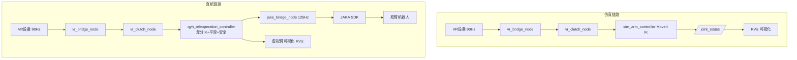

# QYH 具身机器人工作空间

完整的双臂人形机器人VR遥操作控制系统。

## 🚀 快速开始

```bash
# 编译项目
cd ~/qyh_jushen_ws/qyh_jushen_ws
colcon build
source install/setup.bash

# 启动完整系统
ros2 launch qyh_teleoperation_bringup full_system.launch.py robot_ip:=192.168.2.200
```

## 📖 完整文档

详细的功能包说明、接口定义和使用指南，请查看：

**[📘 完整说明文档 (PACKAGE_DOCUMENTATION.md)](./PACKAGE_DOCUMENTATION.md)**

## 📦 核心功能包

| 功能包 | 功能 | 类型 |
|--------|------|------|
| **qyh_dual_arms_description** | 双臂机器人URDF模型 | 描述 |
| **qyh_dual_arms_moveit_config** | MoveIt2运动规划配置 | 配置 |
| **qyh_gripper_control** | JODELL EPG夹爪控制（Modbus RTU） | C++ |
| **qyh_gripper_gui** | 夹爪监控GUI | Python |
| **qyh_head_control** | HTD-85H头部舵机控制 | Python |
| **qyh_jaka_control** | JAKA双臂核心控制（125Hz EtherCAT） | C++ |
| **qyh_jaka_control_gui** | JAKA控制GUI | Python |
| **qyh_standard_robot** | Standard底盘控制（Modbus TCP） | C++ |
| **qyh_standard_robot_gui** | 底盘控制GUI | Python |
| **qyh_vr_calibration** | VR校准和坐标变换 | Python |
| **qyh_teleoperation_controller** | 核心遥操作控制器（差分IK+平滑） | C++ |
| **qyh_teleoperation_bringup** | 完整系统启动配置 | Launch |

## 🔧 系统架构

```
VR设备(90Hz) → VR接口 → 校准 → 遥操作控制器 → JAKA桥接 → 双臂机器人(125Hz)
                                    ↓               
                               MoveIt2虚拟臂       
                             (IK求解+可视化)
```

## 🧩 仿真与真机数据流对比



- **仿真链路**：sim_arm_controller 直接调用 MoveIt IK，结果用于 RViz 可视化。
- **真机链路**：teleoperation_controller 实时差分IK+轨迹平滑，输出到 JAKA EtherCAT 伺服，支持虚拟臂同步可视化。

## 💡 主要特性

- ✅ **高频伺服控制**: 125Hz EtherCAT实时伺服
- ✅ **低延迟遥操作**: 端到端延迟 ~25ms
- ✅ **差分IK**: Damped Least Squares算法
- ✅ **轨迹平滑**: 三阶段速度/加速度/jerk限制
- ✅ **安全检查**: 关节限位/碰撞检测/奇异点检测
- ✅ **力反馈**: 夹爪力传感器数据采集
- ✅ **多用户校准**: VR坐标系校准和配置管理
- ✅ **可视化**: RViz实时可视化
- ✅ **图形界面**: PyQt5 GUI监控

## 🎯 使用场景

1. **VR遥操作**: 使用VR设备实时控制双臂机器人
2. **数据采集**: 具身智能训练数据采集
3. **仿真训练**: MoveIt2仿真环境
4. **任务执行**: 复杂双臂协同操作

## 🌐 Web 管理界面

本项目包含一个完整的 Web 管理界面（**qyh_jushen_web**），可以在浏览器中管理 ROS GUI：

- ✅ 在线启动/停止 ROS GUI（夹爪/机械臂/底盘）
- ✅ 实时状态监控
- ✅ 批量操作管理
- ✅ 管理员权限控制

**详细说明**: [ROS GUI Web 集成文档](./ROS_GUI_WEB_INTEGRATION.md)

## 📚 相关文档

- [完整功能包文档](./PACKAGE_DOCUMENTATION.md) - 所有包的详细说明和接口
- [ROS GUI Web 集成](./ROS_GUI_WEB_INTEGRATION.md) - Web 界面管理 ROS GUI
- [遥操作集成指南](../TELEOPERATION_INTEGRATION_GUIDE.md)
- [VR遥操作架构](../VR_TELEOPERATION_ARCHITECTURE.md)
- [开发总结](../DEVELOPMENT_SUMMARY.md)
- [阶段一完成报告](../PHASE1_COMPLETION_REPORT.md)

## 🛠️ 硬件要求

- **双臂**: JAKA Zu7 × 2
- **夹爪**: JODELL EPG系列 × 2 (Modbus RTU)
- **头部**: HTD-85H舵机 Pan/Tilt
- **底盘**: Standard移动底盘 (Modbus TCP)
- **VR**: 支持ROS2的VR设备（可选模拟器）

## 💻 软件要求

- Ubuntu 22.04
- ROS2 Humble
- MoveIt2
- Python 3.10+
- PyQt5

## 📞 联系方式

- **维护者**: qyh <jsqinyinghao@live.com>
- **许可证**: Apache-2.0 / MIT / BSD

---

**版本**: 1.0.0 | **更新时间**: 2025-11-27

摄像头 奥比中光 Gemini 335Le
