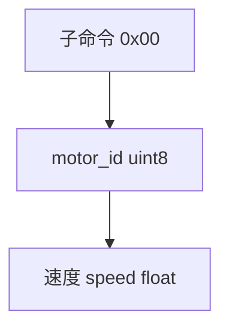
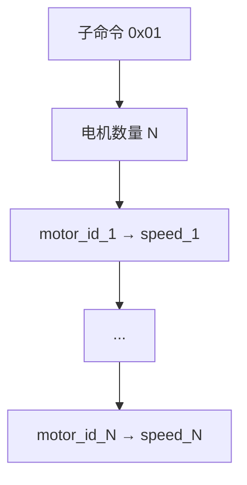
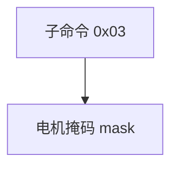
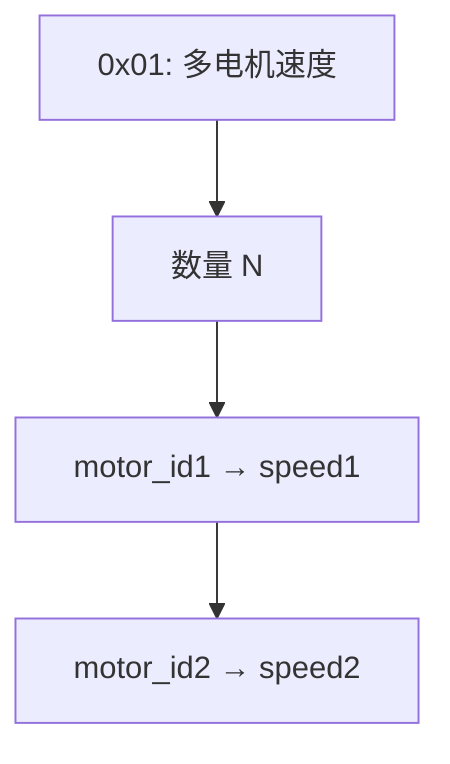
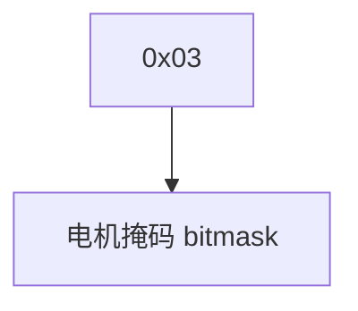
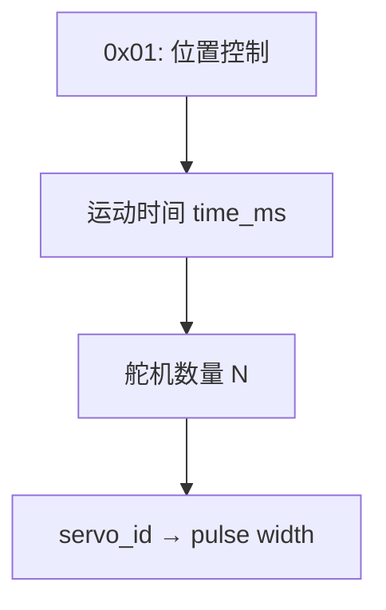
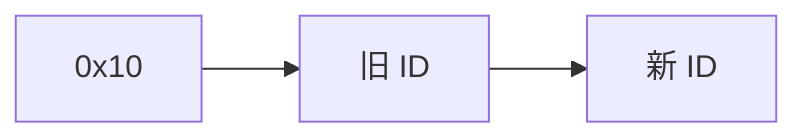
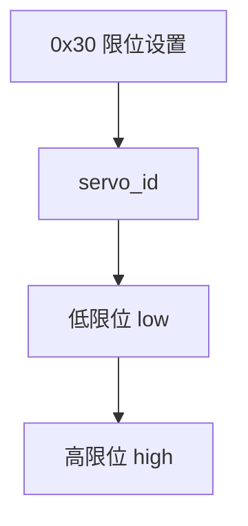

# RRC 电机控制协议（精简版）

## 指令格式（Mermaid）


------------------------------------------------------------------------

## 功能码：`PACKET_FUNC_MOTOR = 3`

### **1. 单个电机控制**



-   帧格式：

```{=html}
<!-- -->
```
    AA 55 03 06 00 motor_id float(C speed) CRC

-   示例：电机 1 以 **-1 r/s** 转动\

```{=html}
<!-- -->
```
    AA 55 03 06 00 00 00 00 80 BF CRC

------------------------------------------------------------------------

### **2. 多个电机运动**



-   帧格式：

```{=html}
<!-- -->
```
    AA 55 03 (5N+2) 01 N (motor_id + float(speed)) * N CRC

-   示例：电机 1：-1 r/s，电机 2：2 r/s

```{=html}
<!-- -->
```
    AA 55 03 0C 01 02 
    01 00 00 00 80 BF 
    02 00 00 00 00 40 CRC

------------------------------------------------------------------------

### **3. 单个电机停止**


-   帧格式：

```{=html}
<!-- -->
```
    AA 55 03 02 02 motor_id CRC

-   示例：停止电机 1\

```{=html}
<!-- -->
```
    AA 55 03 02 02 01 CRC

------------------------------------------------------------------------

### **4. 多个电机停止（掩码控制）**



-   掩码说明：
    -   bit0 = 电机0\
    -   bit1 = 电机1\
    -   bit2 = 电机2\
    -   如此类推\
-   帧格式：

```{=html}
<!-- -->
```
    AA 55 03 02 03 mask CRC

-   示例：停止电机 0 和 2
    -   mask = `00000101b` = `0x05`

    ```{=html}
    <!-- -->
    ```
        AA 55 03 02 03 05 CRC

------------------------------------------------------------------------

## CRC 说明

-   计算范围：`Function + Length + Data`\
-   CRC8-Maxim（多项式 0x31，初始 0xFF，输出反转）


补充：
好的！下面是 **全新整理的、完整且准确的 RRC 电机控制协议（Motor + Bus Servo）Markdown 文件**，特别强调你关心的：

* 编码器电机（PACKET_FUNC_MOTOR）
* 总线舵机位置控制（PWM 脉宽 = 位置）
* 限位设置（min/max）
* 偏差（offset）
* ID 设置
* 上电/掉电

并附带 mermaid 图表以提升可读性。

你可以 **直接复制保存为 `RRC_motor_full.md`**。

---

# RRC Motor & Bus Servo 控制协议（完整版）

## 1. 帧格式（统一结构）


---

# 2. 编码器电机控制（PACKET_FUNC_MOTOR = 3）

> ⚠ **注意：编码器电机不支持角度/位置模式，只有速度模式。
> 若需要位置控制，必须自己写 PID 循环。**

---

## 2.1 单电机速度控制（子命令 0x00）

```mermaid
flowchart TD
    A[0x00: 速度控制] --> B[motor_id (uint8)]
    B --> C[speed (float32, 小端)]
```

**格式**

```
AA 55 03 06 00 motor_id speed(float_LE) CRC
```

示例：电机 1 速度 = -1 r/s

```
AA 55 03 06 00 01 00 00 80 BF CRC
```

---

## 2.2 多电机速度控制（子命令 0x01）



**格式**

```
AA 55 03 (5N+2) 01 N (motor_id + float speed)*N CRC
```

---

## 2.3 单电机停止（子命令 0x02）

```
AA 55 03 02 02 motor_id CRC
```

---

## 2.4 多电机停止（掩码）（子命令 0x03）



掩码 bit 位：

| bit | 电机     |
| --- | ------ |
| 0   | motor0 |
| 1   | motor1 |
| 2   | motor2 |

示例：停止 0 和 2 → `00000101 = 0x05`

```
AA 55 03 02 03 05 CRC
```

---

# 3. 总线舵机控制（PACKET_FUNC_BUS_SERVO = 5）

> 🟦 **总线舵机才支持真正的位置控制（position/pulse width）**

所有位置控制均通过 **脉宽 pulse width（0–1000 或 500–2500）** 实现。

示例映射：

| 角度   | 脉宽（示例） |
| ---- | ------ |
| 0°   | 500    |
| 90°  | 1500   |
| 180° | 2500   |

---

# 3.1 位置控制（子命令 0x01）



**格式**

```
AA 55 05 (3N+4) 01 time N (id, pulse)*N CRC
```

示例：舵机 1 → 1500，舵机 2 → 2500，用时 2000ms

```
AA 55 05 0A 01 D0 07 02 
01 DC 05 
02 C4 09 CRC
```

---

# 3.2 舵机上电/掉电（使能）

### 掉电（失能）

```
AA 55 05 02 0B servo_id CRC
```

### 上电（加载扭矩）

```
AA 55 05 02 0C servo_id CRC
```

---

# 3.3 ID 设置（子命令 0x10）



```
AA 55 05 03 10 old_id new_id CRC
```

---

# 3.4 ID 读取（广播方式）（子命令 0x12）

```
AA 55 05 02 12 FE CRC
```

⚠ 必须只连接一个舵机，否则会冲突！

---

# 3.5 偏差（Offset）设定（子命令 0x20）

范围：`-100 ~ +100`

```
AA 55 05 03 20 servo_id offset CRC
```

偏差读取（0x22）：

```
AA 55 05 02 22 servo_id CRC
```

---

# 3.6 位置限位（min/max）设置（子命令 0x30）



范围：0–1000

```
AA 55 05 06 30 servo_id low high CRC
```

读取（子命令 0x32）：

```
AA 55 05 02 32 servo_id CRC
```

---

# 3.7 电压限位（子命令 0x34）

* low ≥ 4500 mV
* high ≤ 14000 mV

```
AA 55 05 06 34 servo_id low high CRC
```

读取：

```
AA 55 05 02 36 servo_id CRC
```

---

# 3.8 温度限位（子命令 0x38）

高温阈值 < 100°C

```
AA 55 05 03 38 servo_id threshold CRC
```

读取（0x3A）：

```
AA 55 05 02 3A servo_id CRC
```

---

# 4. 位置控制的重要说明

> **脉冲宽度 = 舵机位置（position）**

协议没有提供 “角度值” 字段，只有 “pulse width”。

你必须自己定义：

```
pulse = angle_to_pulse(角度)
```

例如常用线性映射：

```
pulse = 500 + angle(°) * (2000 / 180)
```

---

# 5. CRC 说明（CRC-8/MAXIM）

* 多项式：0x31
* 初值：0xFF
* 输出：异或 0xFF（bitwise NOT）
* 校验范围：Function + Length + Data

---

# 6. 总结：哪类电机支持位置控制？

| 功能           | PACKET_FUNC_MOTOR | PACKET_FUNC_BUS_SERVO |
| ------------ | ----------------- | --------------------- |
| 速度控制         | ✔                 | ✔                     |
| **位置控制（角度）** | ❌                 | ✔（用脉宽）                |
| 最大/最小限位      | ❌                 | ✔                     |
| 偏差校准         | ❌                 | ✔                     |
| 电机 ID 设置     | ❌                 | ✔                     |
| 上电/掉电        | ❌                 | ✔                     |

👉 **如果你想让“电机”有位置控制，则必须用 Bus Servo，而不是 Motor。**

---

如果你愿意，我还能为你生成：

* **基于 Motor 的位置 PID 控制代码（C++ / Python）**
* **自动 angle ↔ pulse 转换工具**
* **你机械臂专用的关节控制协议封装库**

需要继续吗？
